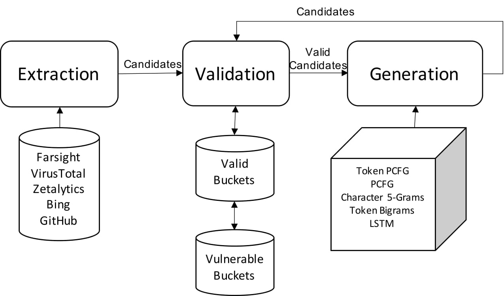

# Stratosphere

Stratosphere discovers publicly accessible cloud storage buckets based on password generation algorithms. Stratosphere includes infrastructure for extracting, generating, and validating bucket names across Amazon S3, Google Cloud Storage, and Alibaba's Object Storage Service.

For more information about Stratosphere, read our paper here.



## Installation

1.  Install python dependencies: `pip install requirements.txt`
2.  Install Go dependencies: `cd bucket_validation && go get`
3.  Install [ZMap](https://github.com/zmap/zmap) and [ZGrab2](https://github.com/zmap/zgrab2)
4.  Install [beanstalkd](https://beanstalkd.github.io/)
5.  Run `cp .env.example .env` and configure relevant API keys
6.  Configure `bucket_validation/listener-config.json` with source IPs, if you would like to use more than one source IP

## Usage

### Extraction

The extraction phase gathers buckets to seed generation algorithms. All extractors will write candidate bucket names to files in `./data/extraction/`, which can then be run through the validator to collect valid bucket names.

Examples to extract buckets from various sources:

Bing: `python main.py --bing`

Farsight: `python main.py --farsight --domain s3.amazonaws.com` (a file of domain names can be provided via `python main.py --farsight -f ./file.txt`)

GrayHat Warfare: `python main.py --grayhatwarfare`

VirusTotal is a 3-part process:

1. Run `python main.py --virustotal --ips` to fetch S3 IP blocks (similar IP ranges can be found for Google Cloud Storage and Alibaba)
2. Run `python main.py --virustotal --pingAll` to ping all IP addresses via ZMap
3. Run `python main.py --virustotal --lookup -n 10000` where `-n` is the maximum number of IPs to be validated (to allow running in batches)

Lastly, you may bring your own data sources. To use unvalidated data (e.g. buckets that may or may not exist), call `feedToValidator` to validate buckets (see "Validating extracted buckets" below). To use validated data, create a folder in `data/validation` with a unique name. Place private buckets in `private.txt` and public buckets in `public.txt`. As always, invoke `gather_all_buckets.sh` in `final_output` to combine found buckets.

### Validation

The validation phase fetches buckets to check whether the bucket exists, and if the bucket is public or private. The source can either be extracted buckets or generated buckets.

The validator will output bucket names in `./data/validation/`, with folders for each platform. Within each platform folder, the validator will write files `public.txt`, `private.txt`, and `no_such_bucket.txt` to indicate the response received for each bucket.

1. Run beanstalk in the background: `./beanstalkd -l 127.0.0.1 -p 11301 &`
2. Run listener: `go run bucket_validation/listener.go`

We recommend running the listener in a seperate shell, such as [screen](https://www.gnu.org/software/screen/), for debugging.

The listener will continually poll the Beanstalk queue and can be left running.

#### Validating extracted buckets

To validate extracted buckets, run `python main.py --feedToValidator -f data/extraction/bing/buckets_output.txt --label bing`, where `-f` is the name of the file containing buckets and `--label` is a label to identify the source.

This will feed all found buckets to the Beanstalk queue, which will be processed by the listener.

#### Combining buckets

In order to combine buckets, the `gather_all_buckets.sh` script in `final_output` can be run to aggregate and deduplicate found buckets across all three sources. This will create three files: `all_platforms_private.txt`, which contains all private buckets, `all_platforms_public.txt`, which contains all public buckets, and `all_platforms_all.txt` which contains all buckets across all platforms.

### Generation

The generation phase generates new bucket names based on previously seen buckets.

The generators rely on the `all_platforms_private.txt` and `all_platforms_public.txt` files in `final_output`. Thus, after running the validator on extracted sources, be sure to run `final_output/gather_all_buckets.sh` to generate these files.

In order to run these files, you will need to add the project to your PYTHONPATH. You can do this by runnning the following:

```
source bucket_generation/add_to_path.sh
python bucket_generation/generators/<generator_name>/guesser.py <custom_generator_name> [--public] [--num_trials N]
```

Examples to generate buckets using different algorithms:

LSTM RNN Generator: `python bucket_generation/generators/rnn/guesser.py rnn --stream --forward`

LSTM RNN Train: `python bucket_generation/generators/rnn/guesser.py rnn --train --forward`

Token PCFG: `python bucket_generation/generators/token_pcfg/guesser.py`

Character 5-Grams: `python bucket_generation/generators/character_grams/guesser.py`
